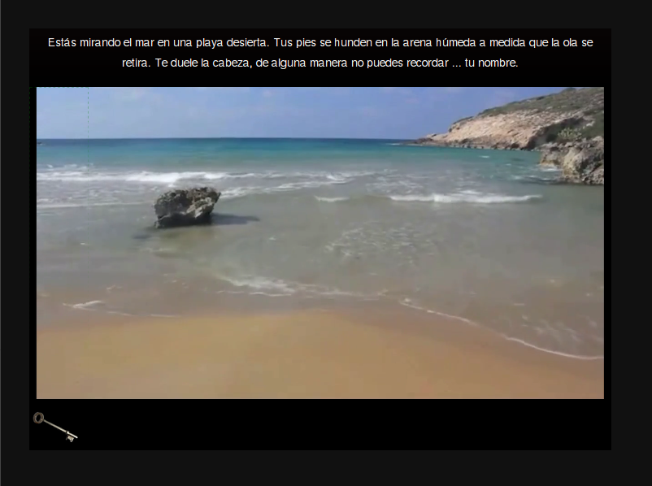
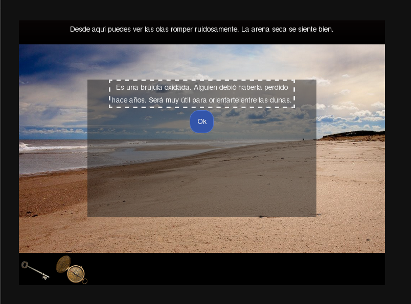

# Aventura
Prototipo de juego de aventura gráfica estilo Myst/Riven hecho en Twine (www.twinery.org). No esperes gráficos finales, es un juego  en desarrollo.

## ¿De qué se trata?
Por ahora de nada. Hay que ir visitando lugares y agarrando objetos que permiten acceder a otros lugares. La idea es generar la sensación de extrañeza que producían los juegos de la saga Myst/Riven.

## ¿Cómo lo juego?
Descargalo y abrí el HTML que viene incluido en Firefox o el navegador que te guste. Para ver el código correctamente, importalo en Twine.

## Créditos
* Claudio Andaur: Código principal, historia y diseño general.
* Ignacio Lossiggio: Macros para el sistema de inventario.

## Screeshots

* Pantalla con un objeto en el inventario (toolbox).

* Pantalla con una descripción de un objeto.

